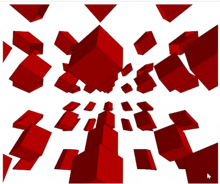

# 3d-cubes-JS
This is a Javascript project that renders 3d shaded cubes on a 2d canvas, using easel.js and math.js. It's a proof-of-concept/practice project for exercising matrix algebra for 3d transformations.

## Usage
Press 1 - Move mode  
Press 2 - Scale mode  
Press 3 - Rotate mode  
Press 4 - Change light direction mode  
Arrow keys, Z, X: Apply transformations  

